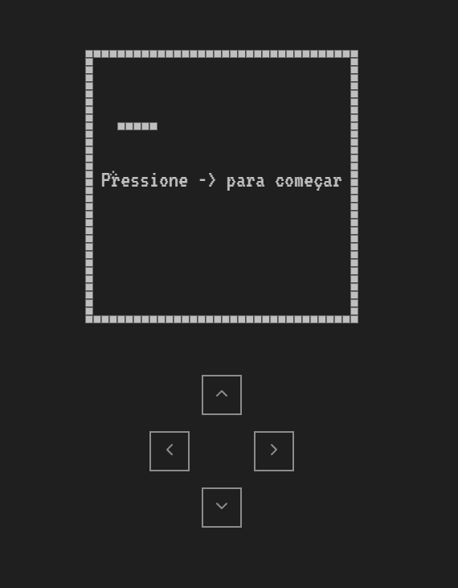

# Snake JS



Bem-vindo ao "Snake JS", uma reinterpretação moderna e divertida do clássico jogo da cobrinha desenvolvida em JavaScript. Este projeto traz toda a nostalgia dos jogos retrô para o mundo digital de hoje e oferece uma experiência de jogo cativante.

## Como Jogar

### Controle por Toque (Dispositivos Móveis):

- Toque nos botões direcionais na tela para direcionar a cobra.
- Deslize o dedo na direção desejada para controlar a cobra de forma intuitiva.

### Controle por Teclado (Computadores):

- Use as setas direcionais (↑, ↓, ←, →) para mover a cobra.
- Pressione a barra de espaço para pausar o jogo.

## Como Fazer Funcionar

Para experimentar o "Snake JS" em seu ambiente local, siga estas etapas:

1. Clone o repositório para o seu ambiente de desenvolvimento:

   ```shell
   git clone https://github.com/seunome/snake-js.git
   ```
2. Navegue até o diretório do projeto:

   ```shell
   cd Snake_js
   ```
3. Abra o arquivo `index.html` no seu navegador de preferência.

## Tecnologias Utilizadas

- HTML5
- CSS3
- JavaScript
- Scss

## Autor

Gustavo Lima de Carvalho

- GitHub: [@gustavopix](https://github.com/gustavopix)
- LinkedIn: [@gustavopix](https://linkedin.com/in/gustavopix)
